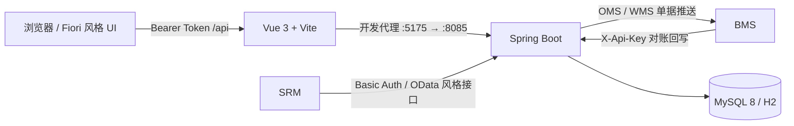

# SAP 风格 ERP 全栈演示系统

> 一个面向 **SRM / BMS 集成与 ERP 流程演示** 的 SAP 风格项目，覆盖采购、库存、销售、财务、成本、生产和基础管理。它不是 SAP 官方产品，也不建议未经安全加固直接用于生产环境。

## 项目概览

项目用一套可运行的前后端应用串联典型 ERP 业务：用户可以从 Fiori 风格 Launchpad 或事务代码进入功能页面，业务过账会同步更新库存、业务单据及 FI / CO 凭证；外部 SRM 可通过 OData 风格接口写入采购数据，BMS 可接收仓储/订单推送并回写对账结果。

### 已实现模块

| 模块 | 主要能力 |
| --- | --- |
| **Basis** | 用户、角色、组织结构、事务代码、操作日志 |
| **MM** | 物料、供应商、采购申请、采购订单、MIGO、库存、MIRO、GR/IR、供应商评价 |
| **SD** | 客户、销售订单、外向交货、拣配、发货过账（PGI）、开票 |
| **FI / FI-AA** | 总账科目、FB50、财务凭证、收付款、清账、冲销、余额、科目确定；固定资产主数据、购置资本化、资产浏览器、月度折旧 |
| **CO** | 成本中心、CO 凭证、成本中心报表 |
| **PP** | BOM、生产订单、发料、报工、完工入库、技术完成（TECO） |
| **Integration** | SRM OData 风格入站、BMS 出入站、接口调用日志 |
| **Dashboard** | 采购、库存、收入、成本、未清项、生产状态、集成成功率汇总 |

## 技术栈

- **后端：** Java 8、Spring Boot 2.7.18、MyBatis-Plus 3.5.3、Maven
- **数据库：** MySQL 8；H2 可用于本地演示和自动化测试
- **前端：** Vue 3、Vite 5、Element Plus、Vue Router、Axios
- **认证：** Bearer Token（业务接口）、Basic Auth（SRM）、API Key（BMS 开放接口）

## 系统架构



业务接口统一返回 `R` 响应结构，列表接口采用分页结构；后端通过 Controller、Service、Mapper / Entity 分层组织代码，初始化 SQL 同时兼容 MySQL 与 H2。

## 目录结构

```text
sap/
├── backend/
│   ├── src/main/java/com/sap/
│   │   ├── basis/          # Basis 基础管理
│   │   ├── mm/             # 物料与采购
│   │   ├── sd/             # 销售与分销
│   │   ├── fi/             # 财务会计
│   │   ├── co/             # 管理会计
│   │   ├── pp/             # 生产计划
│   │   ├── integration/    # SRM / BMS 集成
│   │   ├── dashboard/      # 驾驶舱聚合
│   │   ├── common/         # 响应、分页、异常、单号等公共能力
│   │   └── system/         # 登录、认证与权限
│   ├── src/main/resources/ # 配置、表结构与种子数据
│   └── src/test/            # 单元测试与业务流程集成测试
├── frontend/
│   └── src/
│       ├── api/             # 按业务模块拆分的 API 客户端
│       ├── components/      # 通用组件
│       ├── layout/          # 应用布局
│       ├── router/          # 路由与事务代码分组
│       └── views/           # 各模块页面
├── scripts/smoke.sh         # 后端全链路冒烟脚本
├── docker-compose.yml       # MySQL 8 开发环境
└── README.md
```

## 快速开始

### 环境要求

| 工具 | 建议版本 | 用途 |
| --- | --- | --- |
| JDK | 8 或更高（源码目标为 Java 8） | 运行后端 |
| Maven | 3.6+ | 构建、测试后端 |
| Node.js | 18+ | 构建、运行前端 |
| npm | 与 Node.js 配套 | 安装前端依赖 |
| Docker + Compose | 可选 | 启动 MySQL |
| curl、jq | 可选 | 执行冒烟脚本 |

### 方式一：H2 快速体验（推荐）

不需要安装数据库。打开两个终端，在仓库根目录分别执行：

```bash
# 终端 1：后端
cd backend
mvn spring-boot:run -Dspring-boot.run.profiles=h2
```

```bash
# 终端 2：前端
cd frontend
npm install
npm run dev
```

访问 <http://localhost:5175>，使用以下演示账号登录：

```text
用户名：admin
密码：admin123
```

H2 数据保存在 `backend/data/`，控制台为 <http://localhost:8085/h2>；JDBC URL 为 `jdbc:h2:file:./data/sap`，用户名为 `sa`，密码为空。

### 方式二：使用 MySQL 8

1. 在仓库根目录启动数据库：

   ```bash
   docker compose up -d
   ```

   Compose 默认创建 `sap-mysql` 容器，监听 `3306`，数据库、用户名和密码分别为 `sap`、`root`、`root`。

2. 启动后端：

   ```bash
   cd backend
   mvn spring-boot:run
   ```

3. 另开终端启动前端：

   ```bash
   cd frontend
   npm install
   npm run dev
   ```

后端监听 <http://localhost:8085>；前端监听 <http://localhost:5175>，Vite 会把 `/api` 请求代理到后端。首次启动时，后端会通过 `schema.sql` 和 `data.sql` 自动创建表并写入演示数据。

### 验证后端

```bash
curl -sS -X POST http://localhost:8085/api/auth/login \
  -H 'Content-Type: application/json' \
  -d '{"username":"admin","password":"admin123"}'
```

成功后响应的 `data.token` 可用于调用业务接口：

```bash
TOKEN='<上一步返回的 token>'
curl -sS http://localhost:8085/api/dashboard/summary \
  -H "Authorization: Bearer $TOKEN"
```

## 配置说明

所有常用配置均可通过环境变量覆盖：

| 环境变量 | 默认值 | 说明 |
| --- | --- | --- |
| `DB_HOST` | `localhost` | MySQL 主机 |
| `DB_PORT` | `3306` | MySQL 端口 |
| `DB_NAME` | `sap` | 数据库名 |
| `DB_USER` | `root` | 数据库用户 |
| `DB_PASSWORD` | `root` | 数据库密码 |
| `SAP_AUTH_SECRET` | 启动时临时生成 | Token 签名密钥；多实例/生产环境必须固定设置 |
| `SAP_TOKEN_TTL` | `12h` | 登录 Token 有效期 |
| `SAP_ADMIN_PASSWORD` | `admin123` | 初始化管理员密码 |
| `SAP_CORS_ALLOWED_ORIGINS` | `http://localhost:5175` | 允许跨域的来源，多个值用逗号分隔 |
| `SAP_SRM_USERNAME` | `srm` | SRM Basic Auth 用户名 |
| `SAP_SRM_PASSWORD` | `srm123` | SRM Basic Auth 密码 |
| `SAP_OPEN_API_KEY` | `sap-open-key` | BMS 入站接口密钥 |
| `SAP_BMS_MODE` | `mock` | BMS 客户端模式：`mock` 或 `http` |
| `SAP_BMS_BASE_URL` | `http://localhost:8080` | BMS 服务地址 |
| `SAP_BMS_API_KEY` | `dev-open-key` | SAP 调用 BMS 时发送的密钥 |
| `SAP_BMS_CUSTOMER_CODE` | `CUST-001` | BMS 单据默认客户编码 |

例如：

```bash
export DB_PASSWORD='change-me'
export SAP_AUTH_SECRET='a-long-random-secret'
export SAP_ADMIN_PASSWORD='a-strong-admin-password'
cd backend && mvn spring-boot:run
```

> 默认账号和密钥仅用于本地开发。部署到共享环境前，请更换所有默认凭据、固定 `SAP_AUTH_SECRET`，并通过反向代理启用 HTTPS。

## 主要业务流程

### 采购到付款（P2P）

```text
采购申请（ME51N）→ 审批 → 采购订单（ME21N）
→ 收货（MIGO 101）→ 发票校验（MIRO）→ 应付付款（F-53）
```

- MIGO 101 不允许收货数量超过采购订单开放数量。
- 收货会增加库存、更新 PO 收货数量与 GR/IR，并生成借贷平衡的 FI 凭证。
- MIRO 执行 PO / 收货 / 发票三单匹配；数量不可超过 `GR - IR`。
- 发票单价偏离 PO 单价超过 ±5% 时保存为 `BLOCKED`，且不生成 FI 凭证。

### 销售到收款（O2C）

```text
销售订单（VA01）→ 外向交货（VL01N）→ 拣配 → PGI
→ 客户开票（VF01）→ 应收收款（F-28）
```

PGI 扣减库存并可向 BMS 推送 OMS 出库单；开票产生应收相关财务数据，收款可选择开放项清账。

### 生产流程

```text
BOM（CS01）→ 生产订单（CO01）→ 下达 → 领料（261）
→ 报工（CO11N）→ 完工入库 → 技术完成（TECO）
```

生产领料扣减库存、累计订单实际成本，并生成 FI / CO 相关凭证。

### 其他过账规则

- **MIGO 201：** 成本中心发料，必须提供有效成本中心；扣减库存并生成 FI、CO 凭证。
- **MIGO 311：** 同工厂库存地点转储，不生成 FI 凭证。
- **FB50：** 至少包含两行，借贷合计必须相等。
- **F-53 / F-28：** 支持按开放项付款/收款，清账后从 AP / AR 未清项移除。
- **FB08：** 创建 `AB` 类型反向凭证；原凭证与冲销凭证均不能重复冲销。

## 事务代码与页面

页面路由由前端事务代码分组维护；顶部输入事务代码后，系统查询 `/api/basis/tcodes` 并跳转到对应页面。

| 模块 | 事务代码 | 功能 / 路由 |
| --- | --- | --- |
| MM | `MM01` / `MM03` | 物料主数据 `/mm/materials` |
| MM | `MK01` | 供应商 `/mm/vendors` |
| MM | `ME51N` | 采购申请 `/mm/pr` |
| MM | `ME21N` / `ME23N` | 采购订单 `/mm/po` |
| MM | `MIGO` / `MMBE` | 货物移动 `/mm/migo`、库存 `/mm/stock` |
| MM | `MIRO` / `MIR4` | 发票校验 `/mm/miro`、供应商发票 `/mm/invoices` |
| MM | `MB51` / `GRIR` / `ME63` | 物料凭证、GR/IR、供应商评价 |
| SD | `VD01` / `VA01` | 客户 `/sd/customers`、销售订单 `/sd/so` |
| SD | `VL01N` / `VF01` | 外向交货 `/sd/dn`、开票 `/sd/billing` |
| FI | `FS00` / `FB50` / `FB03` | 总账科目、总账过账、财务凭证 |
| FI | `F-53` / `F-28` / `FB08` | 付款、收款、凭证冲销 |
| FI | `FAGLB03` / `FBL1N` / `FBL5N` / `OBYC` | 余额、应付/应收未清项、科目确定 |
| FI-AA | `AS01` / `AW01N` / `AFAB` | 固定资产主数据、资产价值浏览、购置过账与月度折旧 |
| CO | `KS01` / `KSB1` / `S_ALR_87013611` | 成本中心、CO 凭证、报表 |
| PP | `CS01` / `CO01` / `CO02` / `CO11N` / `COOIS` | BOM 与生产订单流程 |
| Basis | `SU01` / `SPRO` / `SE16` / `SM37` | 用户、组织、事务代码、操作日志 |
| Integration | `SLG1` / `INTF` | 集成日志、接口文档 |

首页为 `/launchpad`，经营驾驶舱为 `/dashboard`。

## 外部系统集成

### SRM → SAP

SRM 入站接口不使用 `/api` 前缀，通过 Basic Auth 认证（开发默认值：`srm` / `srm123`）：

```text
POST /API_PURCHASEORDER_PROCESS_SRV/A_PurchaseOrder
POST /API_MATERIAL_DOCUMENT_SRV/A_MaterialDocumentHeader
POST /API_SUPPLIERINVOICE_PROCESS_SRV/A_SupplierInvoice
POST /API_SUPPLIER_EVALUATION_SRV/A_SupplierEvaluation
```

响应保留 SAP OData 风格的 `d` 包装：

```json
{"d":{"PurchaseOrder":"4500000001"}}
{"d":{"MaterialDocument":"5000000001","MaterialDocumentYear":"2026"}}
{"d":{"SupplierInvoice":"5100000001","FiscalYear":"2026"}}
{"d":{"EvaluationId":"EV..."}}
```

系统内置以下外部编码映射：

| 外部编码 | 内部编码 | 类型 |
| --- | --- | --- |
| `SUP01` / `SUP02` / `SUP03` | `100010` / `100020` / `100030` | 供应商 |
| `SKU001` / `SKU002` / `SKU003` / `SKU004` | `M1001` / `M1002` / `M1003` / `M1004` | 物料 |
| `P001` | `1000` | 工厂 |
| `CUST-001` / `CUST-002` / `CUST-003` | `200010` / `200020` / `200030` | 客户 |

SRM 端使用 HTTP 客户端时可配置：

```text
SRM_SAP_MODE=http
SRM_SAP_BASE_URL=http://<sap-host>:8085
```

### SAP → BMS

默认 `SAP_BMS_MODE=mock`，无需 BMS 即可演示。设置为 `http` 后，SAP 会携带 `X-Api-Key` 请求：

```text
POST {SAP_BMS_BASE_URL}/api/open/oms/docs
POST {SAP_BMS_BASE_URL}/api/open/wms/docs
```

- SD 发货过账（PGI）推送 OMS 出库单。
- MM 采购收货（MIGO 101）推送 WMS 入库单。
- 推送结果会写入集成日志，可在 `SLG1` 页面查看。

### BMS → SAP 对账

```text
POST /api/open/bms/statements
GET  /api/open/bms/statements/{statementNo}
```

请求须携带 `X-Api-Key: <SAP_OPEN_API_KEY>`。对账数据包含 `statementNo`、`direction`、`partnerCode`、`amount`、`taxAmount`、`bizDate`、`remark`；`statementNo` 作为幂等键。

## 开发、构建与测试

```bash
# 后端测试
cd backend && mvn test

# 后端打包
cd backend && mvn clean package

# 前端生产构建
cd frontend && npm run build

# 前端格式化
cd frontend && npm run format
```

后端已运行时，可在仓库根目录执行全链路冒烟测试：

```bash
./scripts/smoke.sh
```

脚本支持覆盖连接和认证参数：

```bash
BASE_URL=http://localhost:8085 \
SAP_BASIC_AUTH=srm:srm123 \
OPEN_KEY=sap-open-key \
./scripts/smoke.sh
```

冒烟流程覆盖登录、PR 转 PO、SRM 采购/收货/发票/评价、BMS 对账、Dashboard、交货与集成日志查询。脚本会写入测试数据，建议仅在本地或专用测试库运行。

## 常见问题

### 前端能打开，但接口返回 401

重新登录并确认请求包含 `Authorization: Bearer <token>`。Token 默认有效期为 12 小时；重启后端且未固定 `SAP_AUTH_SECRET` 时，旧 Token 会失效。

### 后端无法连接 MySQL

确认容器状态和端口占用：

```bash
docker compose ps
docker compose logs mysql
```

然后检查 `DB_HOST`、`DB_PORT`、`DB_NAME`、`DB_USER` 与 `DB_PASSWORD`。若只需本地体验，可直接切换到 H2 profile。

### 浏览器提示跨域错误

开发环境应通过 `http://localhost:5175` 访问。若前端部署在其他来源，将完整 origin 加入 `SAP_CORS_ALLOWED_ORIGINS`（多个来源用逗号分隔）后重启后端。

### 如何重置本地数据

- **H2：** 停止后端并删除 `backend/data/` 后重新启动。
- **MySQL：** `docker compose down -v` 会删除 Compose 数据卷及其中所有数据，再次 `docker compose up -d` 会创建空数据库。

> `docker compose down -v` 是破坏性操作，请勿对需要保留的数据执行。
