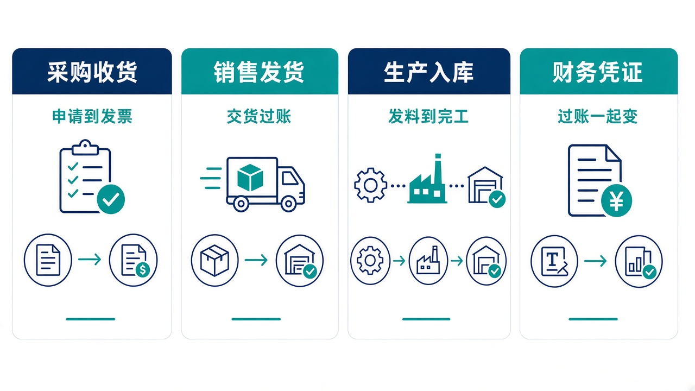
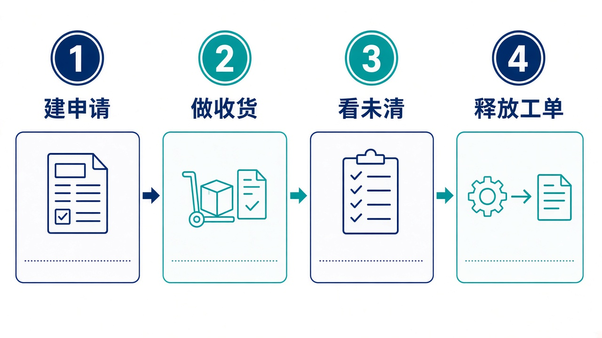

# 给大家讲：ERP 演示系统怎么用

这是一套可运行的 SAP 风格 ERP，用来把采购、库存、销售、生产和财务凭证串起来。它不是 SAP 官方产品。控制塔可以建采购申请、释放申请和生产订单，收货、发货和凭证仍在这里过账。亮点短表见 [项目亮点](./项目亮点.md)。

## 适合什么场景

| 场景 | 在这里怎么做 |
| --- | --- |
| 要从申请买到入库 | 采购申请、采购订单、收货、发票校验。收货会动库存 |
| 销售要发货 | 销售订单、外向交货、拣配、发货过账、开票 |
| 要生产 | 释放生产订单，发料、报工、完工入库 |
| 要看账是否跟着业务走 | 业务过账同时产生财务凭证。过账期间关掉后，期间外不能再过 |
| 控制塔发现原料不够 | 它只能建申请或释放单据。过账仍要在本系统做 |

## 亮点

1. 过账不是各记各的表，库存、业务单据和财务凭证一起变。
2. 可以从启动台进，也可以按事务代码进。
3. 供应商系统按入站接口写采购数据，结算系统可以推送单据并回写对账。
4. 没有开放密钥时，控制塔登录后仍能建采购申请、释放申请和生产订单。

## 一天怎么用

1. 看采购申请和生产订单里哪些还没释放。
2. 收货或发货过账，确认库存变了。
3. 看应收应付未清项和总账。
4. 需要生产时释放工单，再发料和入库。

演示数据里的物料要能在主数据中找到，否则建申请会按本系统的校验失败。
